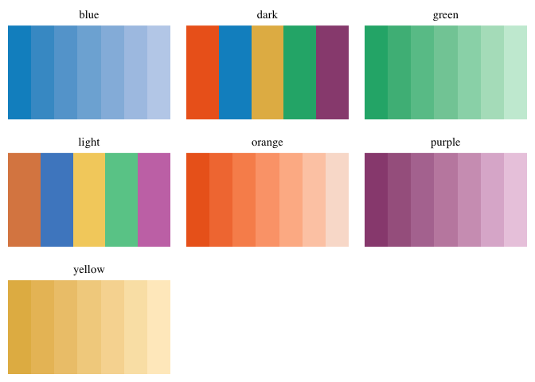
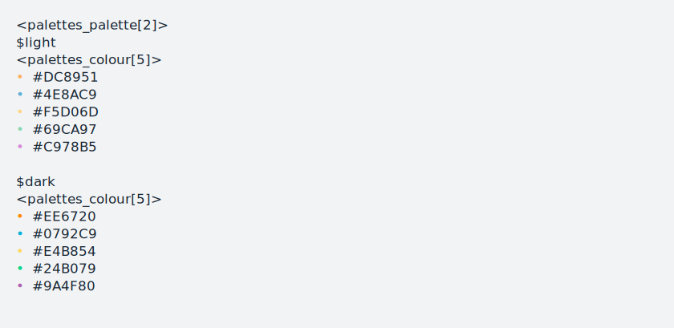
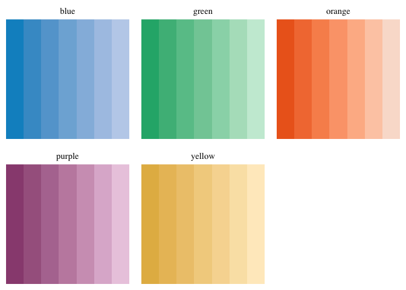
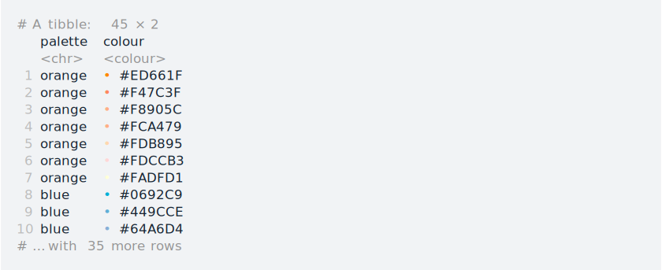
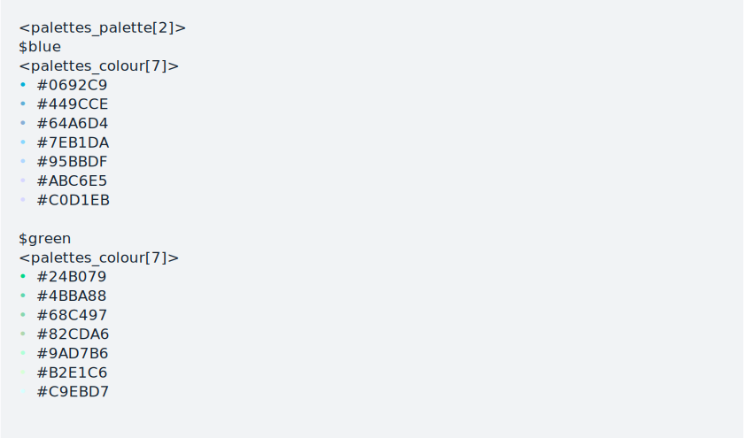
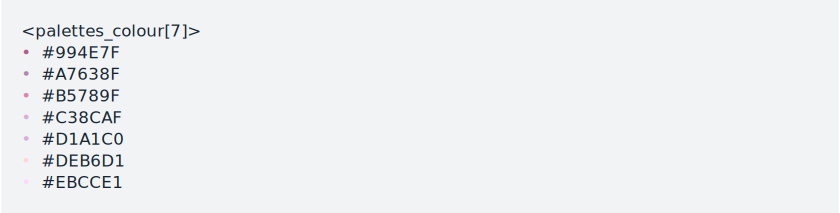

<!-- README.md is generated from README.Rmd. Please edit that file -->

# sunsets

<!-- badges: start -->
<!-- badges: end -->

Colour palettes inspired by sunsets in the Canadian Prairies.

The main purpose of sunsets is to serve as an example showing how to
create a colour palette package with the **palettes** package. The
palettes package provides a comprehensive library for colour vectors and
colour palettes using a new family of colour classes (`palettes_colour`,
and `palettes_palette`) that always print as hex codes with colour
previews.

Colour palette packages created with palettes have access to the
following capabilities, all without requiring you to write any code:
formatting, casting and coercion, extraction and updating of components,
plotting, colour mixing arithmetic, and colour interpolation. See the
[Creating a colour palette
package](https://mccarthy-m-g.github.io/palettes/articles/creating-packages.html)
vignette in palettes for a step-by-step guide.

See the following vignettes to learn how to use sunsets’ palettes with
other packages:

-   [Using palettes with
    ggplot2](https://mccarthy-m-g.github.io/palettes/articles/ggplot2.html)
-   [Using palettes with
    gt](https://mccarthy-m-g.github.io/palettes/articles/gt.html)
-   [Using palettes with
    biscale](https://mccarthy-m-g.github.io/palettes/articles/biscale.html)
-   [Compatibility with other colour
    packages](https://mccarthy-m-g.github.io/palettes/articles/compatibility.html)

## Included palettes



## Installation

You can install the development version of sunsets from
[GitHub](https://github.com/) with:

``` r
# install.packages("devtools")
devtools::install_github("mccarthy-m-g/sunsets")
```

## Usage

``` r
library(sunsets)
#> Loading required package: palettes
```

sunsets comes with a set of 2 discrete colour palettes, and 5 sequential
colour palettes, which can be accessed from the following R objects:

-   `sunset_palettes_discrete` for discrete palettes
-   `sunset_palettes_sequential` for sequential palettes
-   `sunset_palettes` for all palettes

To preview the palettes in the console simply print them:

``` r
sunset_palettes_discrete
```



To preview the palettes in the Plots pane use `plot()`:

``` r
plot(sunset_palettes_sequential)
```



To cast palettes to a tibble use `as_tibble()`:

``` r
as_tibble(sunset_palettes)
```



Palettes can be subset using `[`, `[[`, and `$`.

-   To extract one or more palettes use `[`:

    ``` r
    sunset_palettes_sequential[c("blue", "green")]
    ```

    

-   To extract a single palette as a colour vector use `[[` or `$`:

    ``` r
    sunset_palettes_sequential[["purple"]]
    ```

    

    ``` r
    sunset_palettes_sequential$purple
    ```

    

-   To get names of palettes use `names()`:

    ``` r
    names(sunset_palettes_sequential)
    #> [1] "orange" "blue"   "yellow" "green"  "purple"
    ```

## Documentation

See also documentation for the palettes package at
[`https://mccarthy-m-g.github.io/palettes/`](https://mccarthy-m-g.github.io/palettes/reference/index.html)
or in the installed package: `help(package = "palettes")`.

## License

CC0
